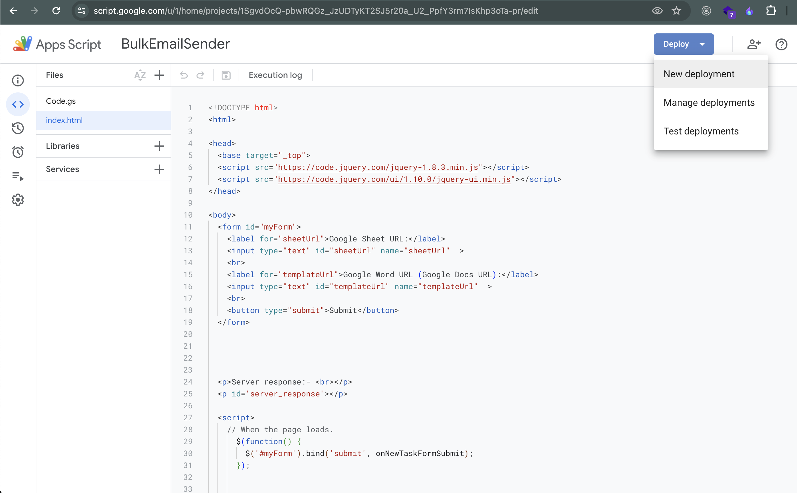
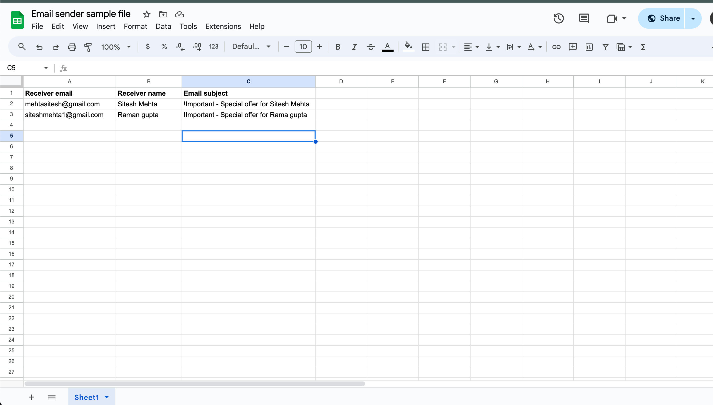
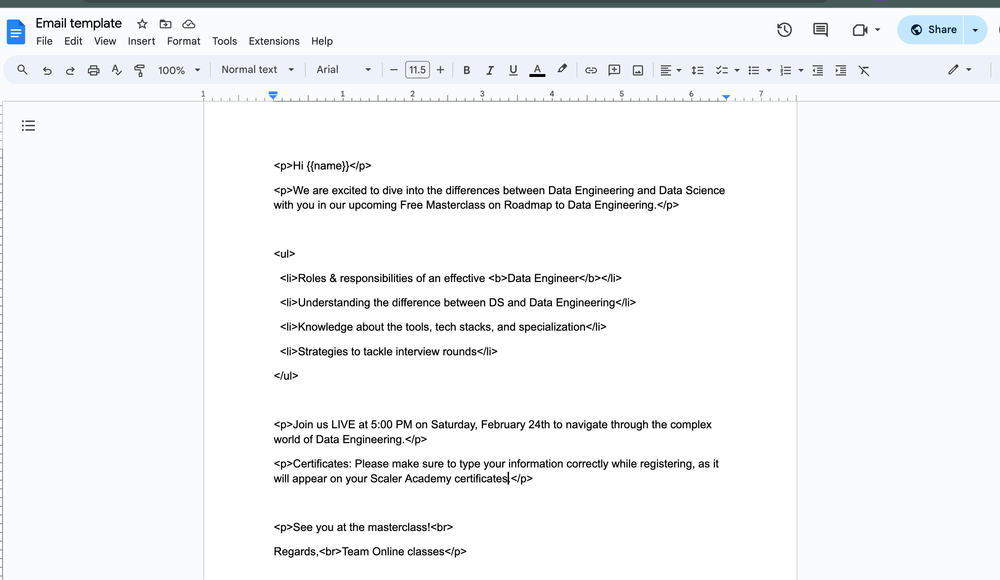
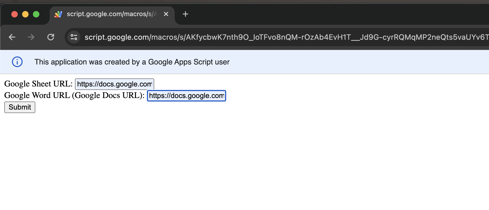

# Email Sending Google App Script

This Google Apps Script allows you to send emails to multiple recipients through a Google Sheet.

## Usage Instructions

### Step 1: Create Google Script Project
1. Go to [Google Apps Script](https://www.google.com/script/start/).
2. Create a new project.

### Step 2: Paste the Code
Paste the provided code into your Google Apps Script editor.

### Step 3: Deploy as Web App
1. Click on 'New deployment'.
2. Choose "Web App" and deploy your app.

### Step 4: Set up Google Sheet
Open a Google Sheet and fill in the details as provided in the sample file.

### Step 5: Create Email Template
Create a Google Doc and paste your email template in HTML format. Use `{{name}}` as a placeholder for the recipient's name in the email template file.

### Step 6: Use the App
1. Visit the deployed URL of your App Script.
2. Enter the URLs of your Google Doc and Google Sheet.
3. Submit to send the details.

